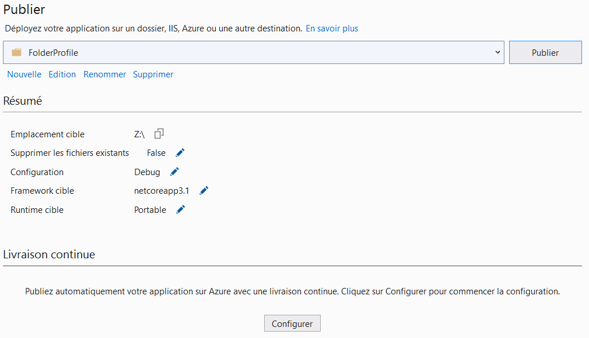

**Configuration d'ASP.net Core Runtime 3.1.x sur Raspberry PI 4 avec Ubuntu server 20.04 LTS**

Auteur : Johann Brochier - 2020

Prérequis

* Raspberry PI 4 avec Ubuntu server 20.04 LTS
* Serveur Web Apache 
* Mono complete

##### Installation d'ASP.net core Runtime 3.1.x

Télécharger et installer ASP.net Core 3.1.x **en manuel**. La version d'Ubuntu server 20.04 pour Raspberry Pi ne permet pas l'installation via le dépôt de chez Microsoft pour l'utilisation d'aptitude.

https://dotnet.microsoft.com/download/dotnet-core/3.1

Télécharger le binaire ARM64 et le décompresser à l'endroit souhaité.

Pour ma part j'ai créé un répertoire dotnet à la racine du disque qui recevra toute la hiérarchie du runtime dotnet.

```
sudo mkdir /dotnet
```

Et la décompression

```
sudo tar -zxvf aspnetcore-runtime-3.1.x-linux-arm64.tar.gz -C /dotnet/
```

##### Configuration d'Apache pour ASP.NET

Créer le répertoire qui recevra la webApp.

Exemple :

```
sudo mkdir /var/www/webApp
```

Activer les modules mono d'Apache

```
sudo a2enmod mod_mono
sudo a2enmod mod_mono_auto
```

Activer les modules proxy d'Apache

```
sudo a2enmod proxy
sudo a2enmod proxy_connect
sudo a2enmod proxy_http
```

Activer le module headers d'Apache

```
sudo a2enmod headers
```

Créer un virtual host pour servir la webApp par Apache. Ce virtual host fera le proxy entre Apache sur le port 80 et Kestrel (port par défaut 5000 pour http) . Dans le cas d'une utilisation SSL, il suffit de configurer Apache en SSL et de servir la webApp sur le port 443. Pour info, le port SSL par défaut de Kestrel est le 5001.

```
<VirtualHost *:*>
    RequestHeader set "X-Forwarded-Proto" expr=%{REQUEST_SCHEME}
</VirtualHost>

<VirtualHost *:80>
    ProxyPreserveHost On
    ProxyPass / http://127.0.0.1:5000/
    ProxyPassReverse / http://127.0.0.1:5000/
    ServerName domaine.com
    ErrorLog ${APACHE_LOG_DIR}monAppli-error.log
    CustomLog ${APACHE_LOG_DIR}monAppli-access.log common
</VirtualHost>
```

Redémarrer Apache

```
sudo systemctl restart apache2
```


##### Déploiement de la webApp

Générer la webApp (exemple Visual Studio 2019) et la publier dans /var/www/webApp



Créer le service qui va démarrer et monitorer la webApp ASP.net

```
sudo vi /etc/systemd/system/webapp.service
```

```
[Unit]
Description=ASP.NET Core 3.1 monAppli

[Service]
WorkingDirectory=/var/www/webApp
ExecStart=/dotnet/dotnet /var/www/webApp/monAppli.dll
Restart=always

# Restart service after 10 seconds if the dotnet service crashes:

RestartSec=10
KillSignal=SIGINT
SyslogIdentifier=dotnet-empower
User=www-data
# Environment=ASPNETCORE_ENVIRONMENT=Production
Environment=ASPNETCORE_ENVIRONMENT=Development
Environment=DOTNET_PRINT_TELEMETRY_MESSAGE=false

[Install]
WantedBy=multi-user.target
```

Activer et démarrer le service

```
sudo systemctl enable webapp
sudo systemctl start webapp
```

A partir de là, la webApp est servie par Kestrel et est disponible via le port 80 d'Apache grâce au proxy (s'il n'y a pas d'erreur de configuration).
